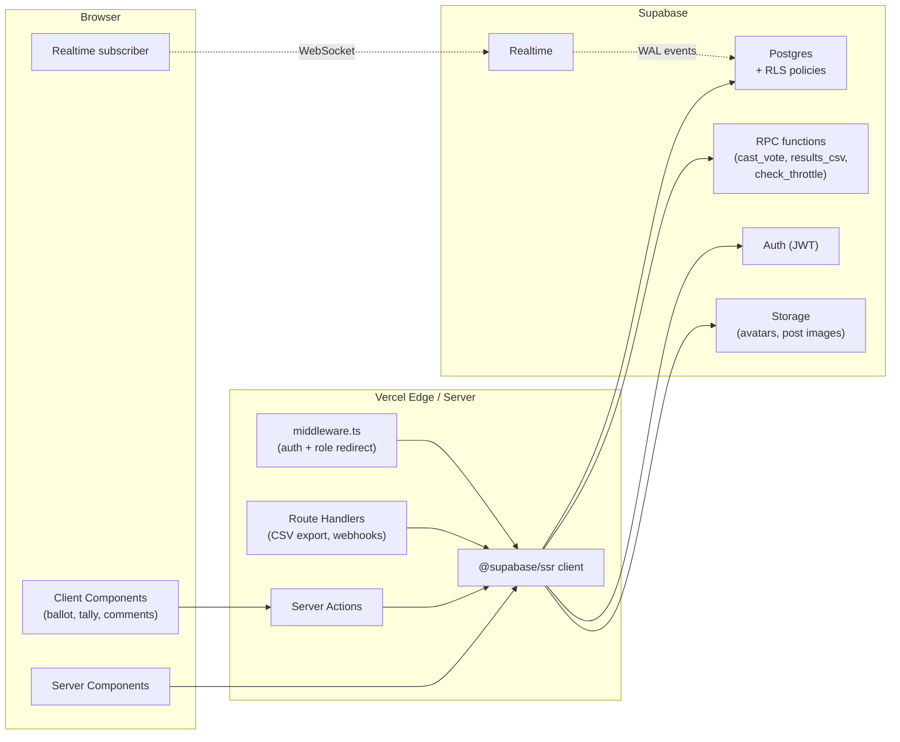
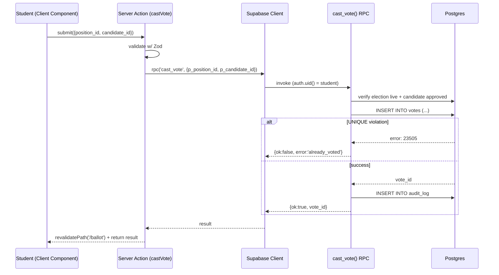
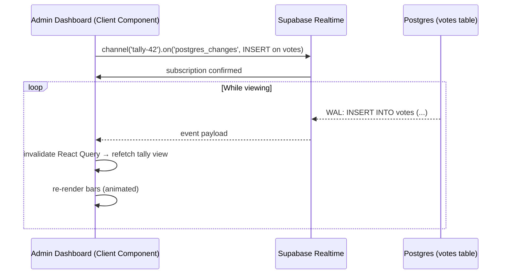
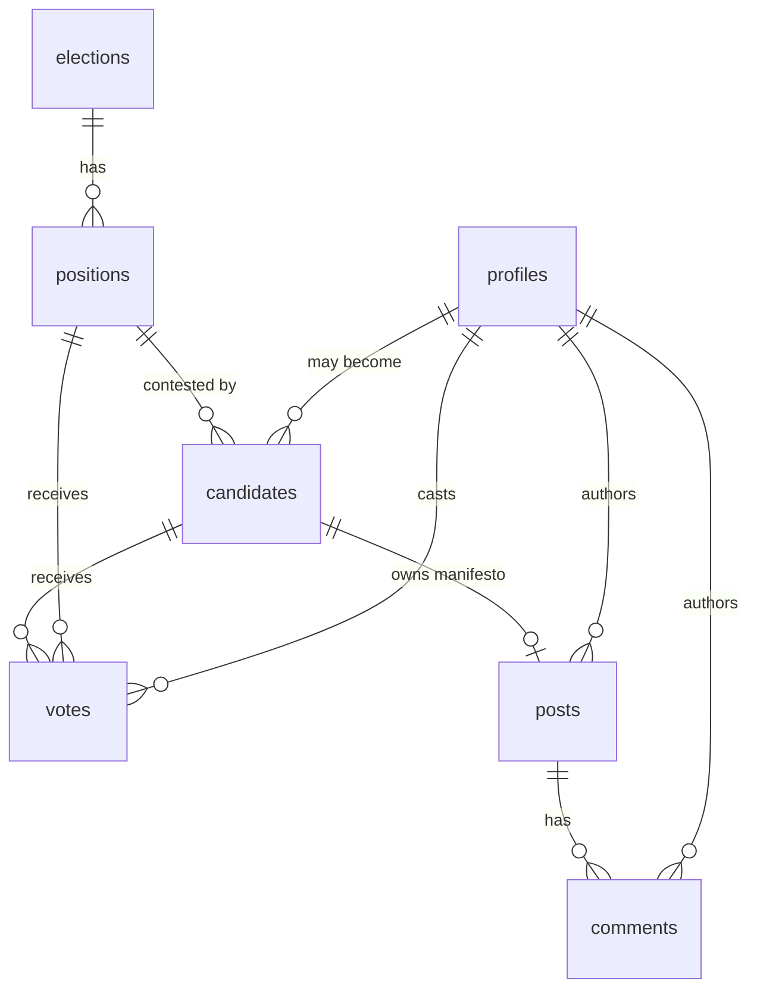

# Product Requirements Document
## Enhanced Web-Based University Voting System with Integrated Social Interaction Platform
### Next.js + Supabase Edition

| Field | Value |
|---|---|
| **Project codename** | `oau-evote-social` |
| **Owner** | Adekola Abdullateef Olalekan (CSC/2019/115) |
| **Supervisor** | Prof. B. S. Afolabi |
| **Institution** | Department of Computer Science and Engineering, Faculty of Technology, Obafemi Awolowo University |
| **Document version** | 2.0 (Next.js + Supabase) |
| **Status** | Ready for implementation |
| **Target stack** | Next.js 15 (App Router) · TypeScript 5 · Supabase (Postgres 15 + Auth + Storage + Realtime) · Tailwind CSS 4 · shadcn/ui · Zod · React Hook Form |
| **Build agent** | Claude Code |

> **⚠️ Chapter 3 alignment note**
> The submitted Chapter 3 specifies PHP/MySQL/XAMPP. Adopting this PRD requires updating:
> - §3.6.1 → replace "Three-Tier Client-Server" with "Edge-rendered Next.js + Supabase BaaS (still logically three-tiered: client / server actions + edge / managed Postgres)"
> - §3.9 → swap tool stack (Next.js, TypeScript, Supabase, Tailwind, Vercel)
> - §3.10 → replace Bcrypt-via-PHP with Supabase Auth (bcrypt internally); `mysqli_real_escape_string` → parameterized Postgres + Row-Level Security; session management → JWT in HTTP-only cookies via `@supabase/ssr`
>
> The pseudocode in §3.6.2 remains valid and stack-agnostic.

---

## 1. Executive Summary

OAU's existing voting platform (Votar, by Trybe City) is a pure transactional voting portal — no manifestos in-platform, no candidate-voter dialogue, undocumented security architecture. Pre-election discourse fragments across WhatsApp.

This project delivers a **two-pillar electoral platform** on a modern serverless stack:

1. **Voting Engine** — Supabase Auth + a single `cast_vote()` Postgres function with a `UNIQUE` constraint as the atomic single-vote guarantee.
2. **Social Interaction Layer** — manifestos, threaded(ish) discussion, profiles, real-time updates via Supabase Realtime.

Scope: prototype for OAU SUG-style elections. Out of scope (per Chapter 1.7): biometric auth, blockchain voting, national rollout.

**Why Next.js + Supabase here:** Row-Level Security (RLS) lets the database itself enforce "one student, one vote" and "results hidden until published" — turning what would be application-layer middleware into compile-time-ish guarantees. Supabase Realtime replaces the AJAX polling specified in Chapter 3.3 (Objective 2) with native Postgres change streams.

---

## 2. Goals and Non-Goals

### 2.1 Goals (mapped to Chapter 1.3 objectives)

| ID | Goal | Source |
|---|---|---|
| G1 | Secure web-based voting with seamless student authentication | Obj. i |
| G2 | Real-time vote counting via Supabase Realtime → admin dashboard | Obj. ii |
| G3 | Integrated social module: manifestos, posts, comments | Obj. iii |
| G4 | User profile management for community accountability | Obj. iv |

### 2.2 Non-Goals

- Biometric authentication
- Blockchain-based vote verification
- Multi-tenant / multi-university support
- Native mobile apps (responsive web + optional PWA)
- SMS/OTP (matric + password is chapter-defined)
- Live video debates

---

## 3. Actors and Personas

| Actor | Description | Capabilities |
|---|---|---|
| **Student (Voter)** | Registered OAU student with a matric number | Register, log in, browse manifestos, post/comment, vote once per position |
| **Candidate** | Student approved by admin to contest a position | All student actions + edit own manifesto, respond to manifesto comments |
| **Admin (Electoral Committee)** | OAU SUG electoral officer | Manage elections, positions, approve candidates, view live tally, publish results, moderate |

> Candidate is a **role-by-association** — a `candidates` row links a student to a position. There is no separate candidate user table.

---

## 4. User Stories

### 4.1 Student / Voter
- US-1: Register with matric number, full name, department, level, password → verified account.
- US-2: Log in → land on feed of manifestos + recent posts.
- US-3: View a candidate's full profile (bio, manifesto, photo).
- US-4: Comment on a manifesto or discussion post.
- US-5: During the election window, see active ballot, select one candidate per position, submit.
- US-6: After voting, see a confirmation; cannot vote again for the same position.
- US-7: View live tally **only** after the election closes and results are published.
- US-8: Update own profile (bio, photo, password).

### 4.2 Candidate
- US-9: Create/edit own manifesto (markdown body + cover image).
- US-10: Reply to comments on own manifesto.

### 4.3 Admin
- US-11: Create an election with title, start time, end time.
- US-12: Add positions to an election (President, VP, etc.).
- US-13: Approve students as candidates for positions.
- US-14: Live tally dashboard auto-updates in real time (Supabase Realtime — no polling).
- US-15: Close election; publish results in a separate explicit action.
- US-16: Moderate posts/comments (hide / delete).
- US-17: Export final results as CSV.

---

## 5. Functional Requirements

### 5.1 Authentication & Session
- FR-1.1: Matric format `^[A-Z]{3}/\d{4}/\d{3}$`.
- FR-1.2: Login by **matric number**. Server action derives a synthetic email `csc-2019-115@student.oauife.edu.ng` (matric lowercased, `/` → `-`) and calls `supabase.auth.signInWithPassword({ email, password })`. Document this mapping in README. Real institutional emails can be added in v2.
- FR-1.3: Supabase Auth handles password hashing (bcrypt internally), session JWTs, refresh tokens.
- FR-1.4: Cookies via `@supabase/ssr` — `HttpOnly`, `Secure`, `SameSite=Lax`.
- FR-1.5: Access token TTL = 1 h (default), refresh token TTL = 30 days. Idle logout enforced client-side after 20 min of no activity (route-segment middleware).
- FR-1.6: Failed-login throttling: implemented via a `login_attempts` table + RPC `check_throttle(p_matric)` — 5 fails / 15 min per matric → soft lock. Return generic "Invalid credentials" either way.
- FR-1.7: On registration, a database trigger `on_auth_user_created` copies the new `auth.users.id` into `profiles(id, ...)`.

### 5.2 Voting Engine
- FR-2.1: Election states: `draft` | `live` | `closed`. Voting allowed only when `status = 'live' AND now() BETWEEN start_at AND end_at`.
- FR-2.2: For each `(student_id, position_id)`, exactly one row in `votes` — enforced by `UNIQUE` constraint (the single-vote guarantee).
- FR-2.3: All vote casts go through the `cast_vote(p_position_id, p_candidate_id)` Postgres function. Direct `INSERT` on `votes` is **revoked** from the `authenticated` role.
- FR-2.4: `cast_vote()` is `SECURITY DEFINER`, uses `auth.uid()` to identify the student, validates election state and candidate approval, and relies on `UNIQUE` violation → `already_voted` error for race-condition safety.
- FR-2.5: Vote record stores: `id`, `election_id`, `position_id`, `candidate_id`, `student_id`, `cast_at`, `ip_hash` (sha256, set by an edge middleware passing client IP to the RPC).
- FR-2.6: Admin tally subscribes to `postgres_changes` events on `votes` filtered by `election_id` — UI re-fetches aggregated counts on each event.
- FR-2.7: Students cannot `SELECT` from `votes`. RLS blocks them. Aggregated published results are exposed via a separate `published_results` view, gated on `elections.results_published = true`.

### 5.3 Social Interaction
- FR-3.1: Two post types: `manifesto` (one per candidate per election) and `discussion` (any student, unlimited).
- FR-3.2: Markdown body, sanitized server-side via `rehype-sanitize`.
- FR-3.3: Flat comments (no nesting in v1) on posts.
- FR-3.4: Post / comment `status`: `active` | `hidden` | `deleted`. Only admins can transition out of `active`.
- FR-3.5: Optimistic UI via `useOptimistic` for comment submission.
- FR-3.6: Feed pagination: cursor-based on `created_at DESC, id DESC`.

### 5.4 Profile Management
- FR-4.1: Editable fields: full name, bio (≤ 280 chars), avatar (jpg/png ≤ 2 MB), department, level, password.
- FR-4.2: Avatar uploads → Supabase Storage bucket `avatars`, path `{user_id}/avatar.{ext}`. Public-read bucket; max size enforced by bucket policy.
- FR-4.3: Public profile (`/profile/[id]`) shows: name, avatar, department, level, bio, role badges, recent posts.

### 5.5 Admin Operations
- FR-5.1: CRUD for elections, positions, candidate approvals (all RLS-gated to `role = 'admin'`).
- FR-5.2: Live dashboard: total voters, total voted, turnout %, per-position bar chart, leading candidate flag.
- FR-5.3: Result publishing is explicit (`UPDATE elections SET results_published = true`) — never automatic.
- FR-5.4: CSV export via a Route Handler that calls a `results_csv(p_election_id)` RPC.

---

## 6. Non-Functional Requirements

| Category | Requirement |
|---|---|
| **Performance** | LCP < 2.5 s on 3G Fast; server actions < 300 ms p95; tally RPC < 150 ms with 5,000 votes |
| **Concurrency** | 200 simultaneous vote submissions → zero double-counts (verified by `UNIQUE` violation tests) |
| **Availability** | Prototype — no formal SLA. Must run reliably for a 24-hour election window |
| **Browser support** | Latest 2 versions of Chrome, Edge, Firefox, Safari. iOS Safari 16+, Chrome Android 110+ |
| **Accessibility** | WCAG 2.1 AA on the voting flow: keyboard nav, visible focus, ARIA labels on radio groups, ≥ 4.5:1 contrast |
| **Responsiveness** | Mobile-first; ballot fully usable at 375 px |
| **Security** | See §10 |
| **Auditability** | `audit_log` rows for every vote, login attempt, admin action |
| **Realtime latency** | Tally event delivery < 1 s end-to-end under normal conditions |

---

## 7. System Architecture

### 7.1 Logical Architecture

```
┌─────────────────────────────────────────────────────────────────┐
│  CLIENT (Browser)                                               │
│  Next.js App Router · React 19 · TypeScript · Tailwind          │
│  Server Components by default · Client Components for           │
│  interactive bits (ballot, comment composer, tally chart)       │
└──────────────────────┬──────────────────────────────────────────┘
                       │  HTTPS · cookies w/ Supabase session JWT
                       ▼
┌─────────────────────────────────────────────────────────────────┐
│  EDGE / SERVER (Vercel · Next.js)                               │
│  ┌──────────────────────┐  ┌────────────────────────────────┐   │
│  │  Server Components   │  │  Server Actions                │   │
│  │  (data reads)        │  │  (mutations: vote, post, etc.) │   │
│  └──────────┬───────────┘  └────────────────┬───────────────┘   │
│             │                               │                   │
│  ┌──────────▼───────────────────────────────▼───────────────┐   │
│  │  Supabase JS Client (server-side, @supabase/ssr)         │   │
│  │  Uses user's JWT — RLS enforced per request              │   │
│  └──────────────────────────┬───────────────────────────────┘   │
│             middleware.ts: redirect rules, role checks          │
└────────────────────────────┬┴───────────────────────────────────┘
                             │  HTTPS · Postgres protocol
                             ▼
┌─────────────────────────────────────────────────────────────────┐
│  SUPABASE (managed)                                             │
│  ┌─────────────┐  ┌──────────┐  ┌─────────┐  ┌──────────────┐   │
│  │  Postgres   │  │  Auth    │  │ Storage │  │  Realtime    │   │
│  │  + RLS      │  │  (JWT)   │  │ (S3-    │  │  (WAL →      │   │
│  │  + RPC fns  │  │          │  │  compat)│  │   websocket) │   │
│  └──────┬──────┘  └────┬─────┘  └────┬────┘  └──────┬───────┘   │
│         └──────────────┴────────────┴───────────────┘           │
│                       single managed plane                      │
└─────────────────────────────────────────────────────────────────┘
```

### 7.2 Mermaid Architecture Diagram



### 7.3 Vote Submission Sequence



### 7.4 Real-Time Tally (Admin)



---

## 8. Database Schema

> Postgres 15 (Supabase). All tables in `public` schema. Timestamps `TIMESTAMPTZ` (Supabase default). User IDs are UUIDs matching `auth.users.id`.

### 8.1 Entity-Relationship Diagram



### 8.2 DDL — canonical schema

```sql
-- ============================================================
-- 8.2.1  profiles  (1-to-1 with auth.users)
-- ============================================================
create table public.profiles (
  id            uuid primary key references auth.users(id) on delete cascade,
  matric_no     varchar(20)  not null unique,
  full_name     varchar(150) not null,
  department    varchar(100) not null,
  faculty       varchar(100) not null,
  level         text not null check (level in ('100','200','300','400','500','600')),
  bio           varchar(280),
  avatar_path   text,
  role          text not null default 'student' check (role in ('student','admin')),
  is_active     boolean not null default true,
  created_at    timestamptz not null default now(),
  updated_at    timestamptz not null default now()
);

create index idx_profiles_role on public.profiles(role);

-- ============================================================
-- 8.2.2  elections
-- ============================================================
create table public.elections (
  id                  bigint generated always as identity primary key,
  title               varchar(200) not null,
  description         text,
  status              text not null default 'draft' check (status in ('draft','live','closed')),
  start_at            timestamptz not null,
  end_at              timestamptz not null,
  results_published   boolean not null default false,
  created_by          uuid not null references public.profiles(id),
  created_at          timestamptz not null default now(),
  updated_at          timestamptz not null default now(),
  check (end_at > start_at)
);

create index idx_elections_status on public.elections(status);
create index idx_elections_window on public.elections(start_at, end_at);

-- ============================================================
-- 8.2.3  positions
-- ============================================================
create table public.positions (
  id            bigint generated always as identity primary key,
  election_id   bigint not null references public.elections(id) on delete cascade,
  title         varchar(150) not null,
  description   text,
  display_order int not null default 0,
  created_at    timestamptz not null default now(),
  unique (election_id, title)
);

-- ============================================================
-- 8.2.4  candidates
-- ============================================================
create table public.candidates (
  id                 bigint generated always as identity primary key,
  student_id         uuid not null references public.profiles(id) on delete cascade,
  position_id        bigint not null references public.positions(id) on delete cascade,
  manifesto_post_id  bigint, -- FK added after posts table defined
  approved_at        timestamptz,
  approved_by        uuid references public.profiles(id),
  created_at         timestamptz not null default now(),
  unique (student_id, position_id)
);

-- ============================================================
-- 8.2.5  votes  -- trust-critical
-- ============================================================
create table public.votes (
  id            bigint generated always as identity primary key,
  election_id   bigint not null references public.elections(id),
  position_id   bigint not null references public.positions(id),
  candidate_id  bigint not null references public.candidates(id),
  student_id    uuid   not null references public.profiles(id),
  ip_hash       char(64),
  user_agent    text,
  cast_at       timestamptz not null default now(),
  unique (student_id, position_id)  -- THE single-vote guarantee
);

create index idx_votes_tally on public.votes(position_id, candidate_id);
create index idx_votes_election on public.votes(election_id);

-- ============================================================
-- 8.2.6  posts
-- ============================================================
create table public.posts (
  id            bigint generated always as identity primary key,
  author_id     uuid not null references public.profiles(id) on delete cascade,
  type          text not null check (type in ('manifesto','discussion')),
  candidate_id  bigint references public.candidates(id) on delete set null,
  title         varchar(200),
  body          text not null,
  image_path    text,
  status        text not null default 'active' check (status in ('active','hidden','deleted')),
  created_at    timestamptz not null default now(),
  updated_at    timestamptz not null default now()
);

create index idx_posts_feed on public.posts(status, created_at desc);
create index idx_posts_candidate on public.posts(candidate_id);

-- Now add the FK from candidates back to posts
alter table public.candidates
  add constraint fk_candidate_manifesto
  foreign key (manifesto_post_id) references public.posts(id) on delete set null;

-- ============================================================
-- 8.2.7  comments
-- ============================================================
create table public.comments (
  id          bigint generated always as identity primary key,
  post_id     bigint not null references public.posts(id) on delete cascade,
  author_id   uuid not null references public.profiles(id) on delete cascade,
  body        text not null,
  status      text not null default 'active' check (status in ('active','hidden','deleted')),
  created_at  timestamptz not null default now()
);

create index idx_comments_post on public.comments(post_id, created_at);

-- ============================================================
-- 8.2.8  audit_log
-- ============================================================
create table public.audit_log (
  id          bigint generated always as identity primary key,
  actor_id    uuid references public.profiles(id),
  action      varchar(80) not null,
  target_type varchar(40),
  target_id   bigint,
  meta        jsonb,
  ip_hash     char(64),
  created_at  timestamptz not null default now()
);

create index idx_audit_actor on public.audit_log(actor_id);
create index idx_audit_action on public.audit_log(action);
create index idx_audit_time on public.audit_log(created_at desc);

-- ============================================================
-- 8.2.9  login_attempts (for throttling)
-- ============================================================
create table public.login_attempts (
  id           bigint generated always as identity primary key,
  matric_no    varchar(20) not null,
  ip_hash      char(64) not null,
  success      boolean not null,
  attempted_at timestamptz not null default now()
);

create index idx_attempts_matric_time on public.login_attempts(matric_no, attempted_at desc);

-- ============================================================
-- 8.2.10  published_results (view)
-- ============================================================
create or replace view public.published_results as
select
  v.election_id,
  v.position_id,
  p.title  as position_title,
  c.id     as candidate_id,
  prof.full_name as candidate_name,
  count(v.id)::int as vote_count
from public.votes v
join public.positions   p    on p.id = v.position_id
join public.candidates  c    on c.id = v.candidate_id
join public.profiles    prof on prof.id = c.student_id
join public.elections   e    on e.id = v.election_id
where e.status = 'closed' and e.results_published = true
group by v.election_id, v.position_id, p.title, c.id, prof.full_name;
```

### 8.3 Trigger: profile auto-creation on signup

```sql
create or replace function public.handle_new_auth_user()
returns trigger
language plpgsql
security definer
set search_path = public
as $$
begin
  insert into public.profiles (id, matric_no, full_name, department, faculty, level)
  values (
    new.id,
    coalesce(new.raw_user_meta_data->>'matric_no', 'UNKNOWN'),
    coalesce(new.raw_user_meta_data->>'full_name', 'Unknown'),
    coalesce(new.raw_user_meta_data->>'department', 'Unknown'),
    coalesce(new.raw_user_meta_data->>'faculty', 'Unknown'),
    coalesce(new.raw_user_meta_data->>'level', '100')
  );
  return new;
end;
$$;

create trigger on_auth_user_created
  after insert on auth.users
  for each row execute function public.handle_new_auth_user();
```

### 8.4 The `cast_vote()` RPC — the trust-critical function

```sql
create or replace function public.cast_vote(
  p_position_id  bigint,
  p_candidate_id bigint,
  p_ip_hash      char(64) default null,
  p_user_agent   text default null
)
returns jsonb
language plpgsql
security definer
set search_path = public
as $$
declare
  v_student_id  uuid   := auth.uid();
  v_election_id bigint;
  v_vote_id     bigint;
begin
  if v_student_id is null then
    return jsonb_build_object('ok', false, 'error', 'unauthenticated');
  end if;

  -- 1. Election must be live and within window
  select e.id
    into v_election_id
  from elections e
  join positions p on p.election_id = e.id
  where p.id = p_position_id
    and e.status = 'live'
    and now() between e.start_at and e.end_at;

  if v_election_id is null then
    return jsonb_build_object('ok', false, 'error', 'election_not_live');
  end if;

  -- 2. Candidate must be approved for this position
  if not exists (
    select 1 from candidates
    where id = p_candidate_id
      and position_id = p_position_id
      and approved_at is not null
  ) then
    return jsonb_build_object('ok', false, 'error', 'invalid_candidate');
  end if;

  -- 3. Insert vote; UNIQUE constraint catches double-vote races atomically
  begin
    insert into votes (election_id, position_id, candidate_id, student_id, ip_hash, user_agent)
    values (v_election_id, p_position_id, p_candidate_id, v_student_id, p_ip_hash, p_user_agent)
    returning id into v_vote_id;
  exception
    when unique_violation then
      return jsonb_build_object('ok', false, 'error', 'already_voted');
  end;

  -- 4. Audit
  insert into audit_log (actor_id, action, target_type, target_id, meta, ip_hash)
  values (v_student_id, 'vote.cast', 'votes', v_vote_id,
          jsonb_build_object('position_id', p_position_id, 'candidate_id', p_candidate_id),
          p_ip_hash);

  return jsonb_build_object('ok', true, 'vote_id', v_vote_id);
end;
$$;

grant execute on function public.cast_vote(bigint, bigint, char, text) to authenticated;

-- CRITICAL: revoke direct INSERT to force RPC usage
revoke insert on public.votes from authenticated;
```

### 8.5 Row-Level Security policies

```sql
-- Enable RLS on every table
alter table public.profiles        enable row level security;
alter table public.elections       enable row level security;
alter table public.positions       enable row level security;
alter table public.candidates      enable row level security;
alter table public.votes           enable row level security;
alter table public.posts           enable row level security;
alter table public.comments        enable row level security;
alter table public.audit_log       enable row level security;
alter table public.login_attempts  enable row level security;

-- Helper: is current user an admin?
create or replace function public.is_admin() returns boolean
language sql security definer stable
set search_path = public
as $$
  select exists (select 1 from profiles where id = auth.uid() and role = 'admin');
$$;

-- ---- profiles ----
create policy profiles_read_all on public.profiles
  for select to authenticated using (true);

create policy profiles_update_self on public.profiles
  for update to authenticated
  using (id = auth.uid())
  with check (id = auth.uid() and role = (select role from profiles where id = auth.uid())); -- can't self-promote

create policy profiles_admin_write on public.profiles
  for all to authenticated
  using (public.is_admin())
  with check (public.is_admin());

-- ---- elections ----
create policy elections_read_visible on public.elections
  for select to authenticated
  using (status in ('live','closed') or public.is_admin());

create policy elections_admin_write on public.elections
  for all to authenticated
  using (public.is_admin())
  with check (public.is_admin());

-- ---- positions ----
create policy positions_read_visible on public.positions
  for select to authenticated
  using (
    public.is_admin()
    or exists (select 1 from elections e where e.id = election_id and e.status in ('live','closed'))
  );

create policy positions_admin_write on public.positions
  for all to authenticated
  using (public.is_admin())
  with check (public.is_admin());

-- ---- candidates ----
create policy candidates_read_visible on public.candidates
  for select to authenticated
  using (
    public.is_admin()
    or (approved_at is not null
        and exists (select 1 from positions p
                    join elections e on e.id = p.election_id
                    where p.id = position_id and e.status in ('live','closed')))
  );

create policy candidates_admin_write on public.candidates
  for all to authenticated
  using (public.is_admin())
  with check (public.is_admin());

-- ---- votes (lockdown) ----
-- No SELECT for students. Admins can read. INSERT is revoked entirely (RPC only).
create policy votes_admin_read on public.votes
  for select to authenticated
  using (public.is_admin());

-- ---- posts ----
create policy posts_read_active on public.posts
  for select to authenticated
  using (status = 'active' or public.is_admin() or author_id = auth.uid());

create policy posts_insert_self on public.posts
  for insert to authenticated
  with check (
    author_id = auth.uid()
    and (
      type = 'discussion'
      or (type = 'manifesto'
          and exists (select 1 from candidates c
                      where c.student_id = auth.uid()
                        and c.id = candidate_id
                        and c.approved_at is not null))
    )
  );

create policy posts_update_self on public.posts
  for update to authenticated
  using (author_id = auth.uid())
  with check (author_id = auth.uid());

create policy posts_admin_moderate on public.posts
  for update to authenticated
  using (public.is_admin())
  with check (public.is_admin());

-- ---- comments ----
create policy comments_read_active on public.comments
  for select to authenticated
  using (status = 'active' or public.is_admin() or author_id = auth.uid());

create policy comments_insert_self on public.comments
  for insert to authenticated
  with check (author_id = auth.uid());

create policy comments_update_self on public.comments
  for update to authenticated
  using (author_id = auth.uid())
  with check (author_id = auth.uid());

create policy comments_admin_moderate on public.comments
  for update to authenticated
  using (public.is_admin())
  with check (public.is_admin());

-- ---- audit_log ----
create policy audit_admin_read on public.audit_log
  for select to authenticated
  using (public.is_admin());

-- ---- login_attempts ----
-- No direct access. Only the check_throttle RPC reads/writes.
```

### 8.6 Realtime publication

```sql
-- Enable realtime on votes (admin tally) and comments (live discussion)
alter publication supabase_realtime add table public.votes;
alter publication supabase_realtime add table public.comments;
alter publication supabase_realtime add table public.posts;
```

> RLS still applies to realtime subscriptions — students will not receive `votes` events because they cannot SELECT from `votes`. ✅

---

## 9. Routes, Server Actions & RPC Inventory

### 9.1 Page routes (App Router)

| Path | Render | Auth | Description |
|---|---|---|---|
| `/` | RSC | public | Landing → redirect to `/feed` if signed in, else `/login` |
| `/login` | RSC | public | Login form |
| `/register` | RSC | public | Registration form |
| `/(app)/feed` | RSC + RT | student | Manifesto + discussion feed |
| `/(app)/candidates/[id]` | RSC | student | Candidate profile + manifesto + comments |
| `/(app)/profile/[id]` | RSC | student | Public profile |
| `/(app)/profile/edit` | RSC | student | Edit own profile |
| `/(app)/ballot/[electionId]` | RSC + Client | student | Active ballot (only when election is live) |
| `/(app)/results/[electionId]` | RSC | student | Final results (only when published) |
| `/(admin)/dashboard` | RSC | admin | Admin overview |
| `/(admin)/elections` | RSC | admin | Election CRUD |
| `/(admin)/elections/[id]` | RSC | admin | Election editor (positions + candidate approvals) |
| `/(admin)/elections/[id]/tally` | RSC + RT | admin | Live tally |
| `/(admin)/moderation` | RSC | admin | Post/comment moderation queue |

### 9.2 Server Actions (typed; live in `app/actions/`)

```typescript
// app/actions/auth.ts
'use server'
export async function register(input: RegisterInput): Promise<ActionResult<{ userId: string }>>
export async function login(input: { matricNo: string; password: string }): Promise<ActionResult>
export async function logout(): Promise<void>

// app/actions/votes.ts
'use server'
export async function castVote(input: { positionId: number; candidateId: number }): Promise<ActionResult<{ voteId: number }>>

// app/actions/posts.ts
'use server'
export async function createPost(input: CreatePostInput): Promise<ActionResult<{ postId: number }>>
export async function updateManifesto(input: UpdateManifestoInput): Promise<ActionResult>
export async function createComment(input: { postId: number; body: string }): Promise<ActionResult<{ commentId: number }>>

// app/actions/profile.ts
'use server'
export async function updateProfile(input: UpdateProfileInput): Promise<ActionResult>
export async function uploadAvatar(formData: FormData): Promise<ActionResult<{ path: string }>>

// app/actions/admin.ts
'use server'
export async function createElection(input: CreateElectionInput): Promise<ActionResult<{ id: number }>>
export async function setElectionStatus(input: { id: number; status: 'draft'|'live'|'closed' }): Promise<ActionResult>
export async function publishResults(input: { electionId: number }): Promise<ActionResult>
export async function approveCandidate(input: { candidateId: number }): Promise<ActionResult>
export async function moderatePost(input: { postId: number; status: 'active'|'hidden'|'deleted' }): Promise<ActionResult>
```

All inputs validated with Zod. Standard return shape:

```typescript
type ActionResult<T = void> =
  | { ok: true; data: T }
  | { ok: false; error: { code: string; message: string } }
```

### 9.3 Route Handlers

| Method | Path | Auth | Purpose |
|---|---|---|---|
| GET | `/api/results/[electionId]/export.csv` | admin | CSV export |
| GET | `/api/health` | public | Liveness probe |

### 9.4 RPC functions

| Function | Auth | Purpose |
|---|---|---|
| `cast_vote(position_id, candidate_id, ip_hash, user_agent)` | authenticated | Atomic vote insertion (the single source of truth for casting) |
| `check_throttle(matric_no)` | service role | Returns whether matric is currently locked out |
| `record_login_attempt(matric_no, ip_hash, success)` | service role | Append-only logger |
| `results_csv(election_id)` | admin | Returns final results as a setof rows for CSV streaming |
| `tally_for_election(election_id)` | admin | Returns aggregated vote counts |

---

## 10. Security Strategy

This operationalizes Chapter 3.10 on a stack where most of the chapter's listed controls become *database-enforced* rather than application-enforced.

| Threat | Mitigation | Chapter ref |
|---|---|---|
| Plain-text passwords | Supabase Auth uses bcrypt internally (configurable cost) — never stored plaintext | 3.10 |
| **SQL injection** | All DB access via Supabase JS client → parameterized queries. **Plus RLS** as a defense-in-depth layer at the DB level | 3.10 |
| Session hijacking | Supabase JWT in `HttpOnly`, `Secure`, `SameSite=Lax` cookies; short-lived access tokens + refresh tokens; auto-rotation on refresh | 2.4 (Johnson et al.), 3.10 |
| CSRF | Next.js Server Actions are POST-only, origin-checked, and tied to React hidden form tokens — **no manual CSRF tokens needed** | (enhancement) |
| XSS | All user content rendered through React (escaped by default); markdown sanitized server-side via `rehype-sanitize`; CSP header set in `next.config.ts` | (enhancement) |
| File upload abuse | Supabase Storage bucket policy: MIME whitelist (`image/jpeg`, `image/png`), 2 MB max; filenames regenerated server-side as `{user_id}/avatar.{ext}` | (enhancement) |
| Brute force login | `record_login_attempt` + `check_throttle` RPC: 5 fails / 15 min per matric → soft lock | 3.10 |
| Vote double-submission | `UNIQUE(student_id, position_id)` constraint + `cast_vote()` RPC catching `unique_violation` exception | 3.10 |
| Tampered ballot UI | `cast_vote()` re-validates election state + candidate approval server-side; client-side state is ignored | 3.10 |
| Result leakage before publication | RLS on `votes` blocks student SELECT; `published_results` view requires `results_published=true`; admin-only `tally_for_election` RPC | 3.10 |
| Privilege escalation | `profiles_update_self` policy includes `role = (select role from profiles where id = auth.uid())` — student cannot self-promote to admin | (enhancement) |
| RLS bypass via service role | Service-role key lives only in env vars on the server — never exposed to the client. Use anon key + user JWT for all user-facing operations | (enhancement) |

### 10.1 Security headers (`next.config.ts`)

```typescript
async headers() {
  return [{
    source: '/(.*)',
    headers: [
      { key: 'Content-Security-Policy', value: "default-src 'self'; img-src 'self' data: https://*.supabase.co; connect-src 'self' https://*.supabase.co wss://*.supabase.co; script-src 'self' 'unsafe-inline'; style-src 'self' 'unsafe-inline'; frame-ancestors 'none'" },
      { key: 'X-Frame-Options', value: 'DENY' },
      { key: 'X-Content-Type-Options', value: 'nosniff' },
      { key: 'Referrer-Policy', value: 'strict-origin-when-cross-origin' },
      { key: 'Permissions-Policy', value: 'camera=(), microphone=(), geolocation=()' },
    ],
  }]
}
```

---

## 11. Project Structure

```
oau-evote-social/
├── app/
│   ├── (auth)/
│   │   ├── login/page.tsx
│   │   ├── register/page.tsx
│   │   └── layout.tsx
│   ├── (app)/
│   │   ├── feed/page.tsx
│   │   ├── candidates/[id]/page.tsx
│   │   ├── profile/[id]/page.tsx
│   │   ├── profile/edit/page.tsx
│   │   ├── ballot/[electionId]/page.tsx
│   │   ├── results/[electionId]/page.tsx
│   │   └── layout.tsx
│   ├── (admin)/
│   │   ├── dashboard/page.tsx
│   │   ├── elections/page.tsx
│   │   ├── elections/[id]/page.tsx
│   │   ├── elections/[id]/tally/page.tsx
│   │   ├── moderation/page.tsx
│   │   └── layout.tsx
│   ├── actions/
│   │   ├── auth.ts
│   │   ├── votes.ts
│   │   ├── posts.ts
│   │   ├── profile.ts
│   │   └── admin.ts
│   ├── api/
│   │   ├── health/route.ts
│   │   └── results/[electionId]/export.csv/route.ts
│   ├── layout.tsx
│   ├── globals.css
│   ├── error.tsx
│   └── not-found.tsx
│
├── components/
│   ├── ui/                       # shadcn/ui primitives
│   ├── ballot/
│   │   ├── ballot-card.tsx       # Client component, radio group per position
│   │   └── vote-confirm-dialog.tsx
│   ├── feed/
│   │   ├── post-card.tsx
│   │   ├── comment-list.tsx      # Uses useOptimistic
│   │   └── comment-composer.tsx
│   ├── admin/
│   │   ├── tally-chart.tsx       # Client component, subscribes via Realtime
│   │   └── election-form.tsx
│   ├── profile/
│   │   ├── avatar-uploader.tsx
│   │   └── profile-form.tsx
│   └── nav/
│       ├── main-nav.tsx
│       └── user-menu.tsx
│
├── lib/
│   ├── supabase/
│   │   ├── client.ts             # Browser client (anon key)
│   │   ├── server.ts             # Server client (cookies + anon key)
│   │   ├── admin.ts              # Service-role client (server only, RLS bypass)
│   │   └── middleware.ts         # Cookie refresh helper
│   ├── auth/
│   │   ├── matric-to-email.ts    # Synthetic email derivation
│   │   └── guards.ts             # requireUser(), requireAdmin()
│   ├── validation/
│   │   ├── auth.ts               # Zod schemas
│   │   ├── posts.ts
│   │   ├── votes.ts
│   │   └── profile.ts
│   ├── realtime/
│   │   └── use-tally.ts          # Custom hook wrapping Supabase channel
│   └── utils/
│       ├── ip-hash.ts
│       ├── cn.ts
│       └── format.ts
│
├── types/
│   ├── database.types.ts         # Auto-generated via `supabase gen types`
│   └── domain.ts                 # Hand-written domain types
│
├── supabase/
│   ├── migrations/
│   │   ├── 20260511000001_init_profiles.sql
│   │   ├── 20260511000002_elections.sql
│   │   ├── 20260511000003_positions.sql
│   │   ├── 20260511000004_candidates.sql
│   │   ├── 20260511000005_votes.sql
│   │   ├── 20260511000006_posts.sql
│   │   ├── 20260511000007_comments.sql
│   │   ├── 20260511000008_audit_log.sql
│   │   ├── 20260511000009_login_attempts.sql
│   │   ├── 20260511000010_published_results_view.sql
│   │   ├── 20260511000011_handle_new_user_trigger.sql
│   │   ├── 20260511000012_cast_vote_rpc.sql
│   │   ├── 20260511000013_rls_policies.sql
│   │   └── 20260511000014_realtime_publication.sql
│   ├── seed.sql                  # Admin user + 50 students + sample election
│   └── config.toml
│
├── middleware.ts                 # Auth refresh + route guards
├── tests/
│   ├── unit/
│   │   ├── matric-to-email.test.ts
│   │   └── validation.test.ts
│   └── integration/
│       ├── cast-vote.test.ts     # Concurrency: 50 parallel inserts → 1 row
│       └── rls.test.ts           # Verifies students cannot read votes
│
├── .env.local.example
├── .gitignore
├── next.config.ts
├── tailwind.config.ts
├── tsconfig.json
├── package.json
├── README.md
└── PRD.md                        # This file
```

---

## 12. Implementation Plan (phased for Claude Code)

> Each phase is a self-contained, testable deliverable. Do not start phase N+1 until phase N's acceptance criteria pass.

### Phase 0 — Bootstrap (½ day)
- `pnpm create next-app@latest oau-evote-social --typescript --tailwind --app --eslint`
- Install: `@supabase/supabase-js @supabase/ssr zod react-hook-form @hookform/resolvers`
- Init shadcn/ui: `pnpm dlx shadcn@latest init`
- `supabase init` → link project → set up local Supabase dev environment
- Configure `.env.local` (NEXT_PUBLIC_SUPABASE_URL, NEXT_PUBLIC_SUPABASE_ANON_KEY, SUPABASE_SERVICE_ROLE_KEY)
- **Acceptance:** `pnpm dev` shows Next.js home; `supabase start` runs local Supabase; `supabase status` shows healthy services.

### Phase 1 — Database & Migrations (1 day)
- Write all 14 migration files from §8.2–§8.6, in order.
- Write `supabase/seed.sql`: 1 admin, 50 sample students, 1 election with 3 positions and 2 candidates per position.
- Generate types: `supabase gen types typescript --local > types/database.types.ts`
- **Acceptance:** `supabase db reset` runs all migrations + seeds without errors; `select count(*) from profiles` returns 51; RLS shows enabled on all tables in Supabase Studio.

### Phase 2 — Supabase Clients & Middleware (½ day)
- Implement `lib/supabase/{client,server,admin}.ts` per `@supabase/ssr` patterns.
- Implement `middleware.ts` to refresh sessions and gate `(app)` and `(admin)` route groups.
- Implement `lib/auth/guards.ts` (`requireUser`, `requireAdmin`).
- **Acceptance:** Visiting `/(app)/feed` while logged-out redirects to `/login`; visiting `/(admin)/dashboard` as a student returns 403.

### Phase 3 — Auth Flows (1 day)
- `/register` page → server action calls `supabase.auth.signUp` with `raw_user_meta_data` carrying matric/name/dept/level. Trigger creates the profile row.
- `/login` page → server action derives synthetic email from matric, calls `signInWithPassword`.
- `/logout` server action.
- Throttling: server action invokes `check_throttle` before login attempt; logs result via `record_login_attempt`.
- **Acceptance:** Register a new student → verify row in `profiles`; log in → cookie present; 5 wrong passwords → 6th attempt returns "Account temporarily locked" without hitting Supabase Auth.

### Phase 4 — Profile (½ day)
- `/profile/edit` form using React Hook Form + Zod.
- `uploadAvatar` server action posts to Supabase Storage bucket `avatars` with policy `{user_id}/*`.
- Public profile page at `/profile/[id]`.
- **Acceptance:** Edit bio + upload avatar → both visible on public profile and across the app.

### Phase 5 — Admin: Elections, Positions, Candidates (1.5 days)
- Admin dashboard shell using `(admin)` route group.
- CRUD UI for elections, positions, candidate approvals.
- Status transitions with confirmation modals.
- **Acceptance:** Admin creates election → adds 3 positions → approves 2 students per position → transitions election to `live`. Student now sees the active election in the feed.

### Phase 6 — Social Feed (1.5 days)
- `/feed` server component with cursor-based pagination.
- `createPost` and `createComment` server actions.
- Manifesto editor (a special `createPost` flow with `type='manifesto'` gated to approved candidates by RLS).
- `useOptimistic` on comment submission.
- Realtime subscription on `comments` table → live append on the active post view.
- **Acceptance:** Candidate creates manifesto → appears in feed instantly; another student in a second browser sees the comment appear within 1 s without refresh.

### Phase 7 — Ballot & Voting (2 days)
- `/ballot/[electionId]` server component fetches positions + approved candidates; passes to a client component for selection.
- `castVote` server action calls `supabase.rpc('cast_vote', ...)`.
- Confirmation dialog before submit; success screen after.
- Already-voted positions are hidden from the ballot.
- **Acceptance:**
  - Two browsers, same student, submit simultaneously → exactly 1 row in `votes` (one returns `already_voted`).
  - Postman-direct INSERT to `votes` table with student JWT → 403 (RLS blocks).
  - Election in `draft` or `closed` state → `castVote` returns `election_not_live`.
  - Integration test in `tests/integration/cast-vote.test.ts`: 50 parallel `castVote` calls for the same student → exactly 1 row.

### Phase 8 — Real-Time Tally & Results (1 day)
- Admin `/elections/[id]/tally` page.
- `useTally` hook subscribes to `postgres_changes` on `votes` filtered by `election_id`; on each event, re-runs `tally_for_election` RPC.
- Bar chart rendered with raw SVG or a lightweight lib (recharts is OK, but vanilla SVG keeps bundle small).
- `publishResults` server action.
- Public `/results/[electionId]` page reads from `published_results` view.
- CSV export Route Handler.
- **Acceptance:** Cast a vote in browser A → admin's chart bar grows within 1 s in browser B without refresh; students get 403 on `/results/[id]` until admin clicks "Publish results".

### Phase 9 — Moderation & Audit (½ day)
- `/(admin)/moderation` queue showing recent posts and comments.
- `moderatePost` server action.
- Audit log viewer (read-only table view for admin).
- **Acceptance:** Admin hides a post → it disappears from student feeds; entry appears in audit log.

### Phase 10 — Hardening & Polish (1 day)
- Set CSP and security headers in `next.config.ts`.
- Error boundaries, 404, 500 pages.
- Mobile QA at 375 px.
- A11y pass on the ballot (keyboard nav, ARIA, focus rings).
- README with setup, env, and deployment instructions.
- **Acceptance:** Lighthouse a11y score ≥ 95 on `/ballot/[id]`; security headers visible in network panel; full E2E run on fresh database succeeds.

### Phase 11 — Tests (½ day)
- Vitest setup.
- Unit tests for Zod schemas and `matric-to-email`.
- Integration tests for `cast_vote` concurrency and RLS enforcement (using service role + user JWT).
- **Acceptance:** `pnpm test` green; coverage report shows `cast_vote` and RLS scenarios exercised.

**Total estimate:** ~10–11 working days for a single Claude Code session series.

---

## 13. Acceptance Criteria (system-level)

The system is "done" when:

1. ✅ Fresh student can register, log in, browse feed, comment on a manifesto, and vote on an open election.
2. ✅ Student cannot vote twice — verified under 50-parallel-request concurrency test (`unique_violation` returns `already_voted`).
3. ✅ Admin can run the full lifecycle: create election → add positions → approve candidates → set live → watch real-time tally → close → publish → export CSV.
4. ✅ All passwords managed by Supabase Auth (bcrypt internally); no password material in any application table.
5. ✅ All DB access goes through the Supabase JS client with parameterized queries; RLS enabled on every public table.
6. ✅ Service-role key never reaches the client — `grep -r "SERVICE_ROLE" app/` only shows it inside server-only files (`lib/supabase/admin.ts` and server actions).
7. ✅ Session JWT in `HttpOnly` cookie; verified by inspecting `Set-Cookie` header on login.
8. ✅ Students cannot read `votes` even with their JWT — verified by a curl test against `supabase.from('votes').select()`.
9. ✅ Results invisible to students until `results_published = true`.
10. ✅ Audit log records every login attempt, vote cast, and admin action.
11. ✅ Ballot is keyboard-navigable and renders correctly at 375 px.
12. ✅ Real-time tally event end-to-end latency < 1 s under normal conditions.

---

## 14. Open Questions / Assumptions

Settle these **before Phase 5** — they affect schema and flow:

| # | Question | Working assumption |
|---|---|---|
| Q1 | Are running-mate tickets supported, or strictly single candidates per position? | Single candidates only in v1. |
| Q2 | "Abstain" / "no confidence" option per position? | No — student may simply skip a position by not selecting on the ballot. |
| Q3 | Faculty / departmental scoping (e.g., only Faculty of Tech students vote for Tech faculty rep)? | No — all students vote on all positions in v1. v2 feature. |
| Q4 | Email verification on registration? | **No** in v1 — chapter specifies matric + password only. Supabase Auth's "confirm email" setting should be **off**. |
| Q5 | Password reset flow? | **No** in v1 — admin manually resets via Supabase Studio. Document as known limitation. |
| Q6 | Feed scope: all posts globally, or only posts tied to the active election? | All posts globally, but with a default filter for the active election. |
| Q7 | Live tally visible to students during a live election? | No — only after `results_published = true`. Avoids bandwagon effect. |
| Q8 | Threaded (nested) comments? | No — flat comments only in v1. |
| Q9 | Deployment target — Vercel + Supabase Cloud, or self-host both on the Hostinger VPS? | **Vercel + Supabase Cloud free tier** for the prototype. Self-host conversation is post-defense. |
| Q10 | Should we use Supabase's built-in email-confirmation OR magic-link as a future enhancement? | Document as v2 backlog. |

---

## 15. Glossary

- **Position** — A contestable role within an election (President, VP, etc.).
- **Candidate** — A student approved by admin to contest a specific position.
- **Manifesto** — A `posts` row of `type = 'manifesto'` linked to a candidate; one per candidate.
- **Tally** — Aggregate vote count per `(position, candidate)`.
- **Live** — Election state where `status = 'live' AND now() BETWEEN start_at AND end_at`.
- **RLS** — Row-Level Security: Postgres-enforced row visibility/mutability based on `auth.uid()`.
- **RPC** — Remote Procedure Call: a Postgres function callable from the client via `supabase.rpc()`.
- **Server Action** — A Next.js function that runs on the server and is invoked from a client component as if it were a local async function.

---

## 16. References Anchored to the Submitted Chapters

- **Three-tier architecture** (Chapter 3.6.1) → mapped to Client / Edge+ServerActions / Supabase
- **Voting algorithm pseudocode** (Chapter 3.6.2) → encoded in `cast_vote()` RPC
- **Use-case actors** (Chapter 3.6.3) → Student, Admin, Candidate
- **Vote sequence diagram** (Chapter 3.6.4) → §7.3 above
- **One-Student-One-Vote** (Chapter 3.3, Objective 2) → `UNIQUE(student_id, position_id)`
- **Bcrypt password hashing** (Chapter 3.10) → Supabase Auth (bcrypt internally)
- **Input sanitization** (Chapter 3.10) → Parameterized queries via Supabase JS + RLS
- **Session hijacking mitigations** (Chapter 2.4, Johnson et al., 2021) → Supabase JWT + `HttpOnly` cookies + auto-rotation

---

## 17. Required Chapter 3 Rewrites

Before defense, Adekola must update Chapter 3 to reflect the actual implementation:

| Section | Current text | Required update |
|---|---|---|
| §3.6.1 Architectural Design | "Three-Tier Client-Server Architecture... HTML/CSS/JS / PHP / MySQL" | "Edge-rendered Next.js (presentation + application) with Supabase managed Postgres (data). Logically three-tiered." |
| §3.6.2 Algorithm Design | Pseudocode | Still valid — add a note that it's implemented as a Postgres `SECURITY DEFINER` function (`cast_vote`) |
| §3.9 Tools and Technology Stack | "HTML / CSS / JavaScript / PHP / MySQL / XAMPP" | "Next.js 15 (App Router) with TypeScript; Tailwind CSS; Supabase (Postgres + Auth + Storage + Realtime); deployed to Vercel" |
| §3.10 Security Implementation Strategy | "password_hash() (Bcrypt) / session IDs / mysqli_real_escape_string()" | "Supabase Auth (bcrypt internally); JWT sessions in HttpOnly cookies; parameterized queries; **Row-Level Security policies** as primary access control; CSRF protection via Next.js Server Actions" |

---

**End of PRD.**
